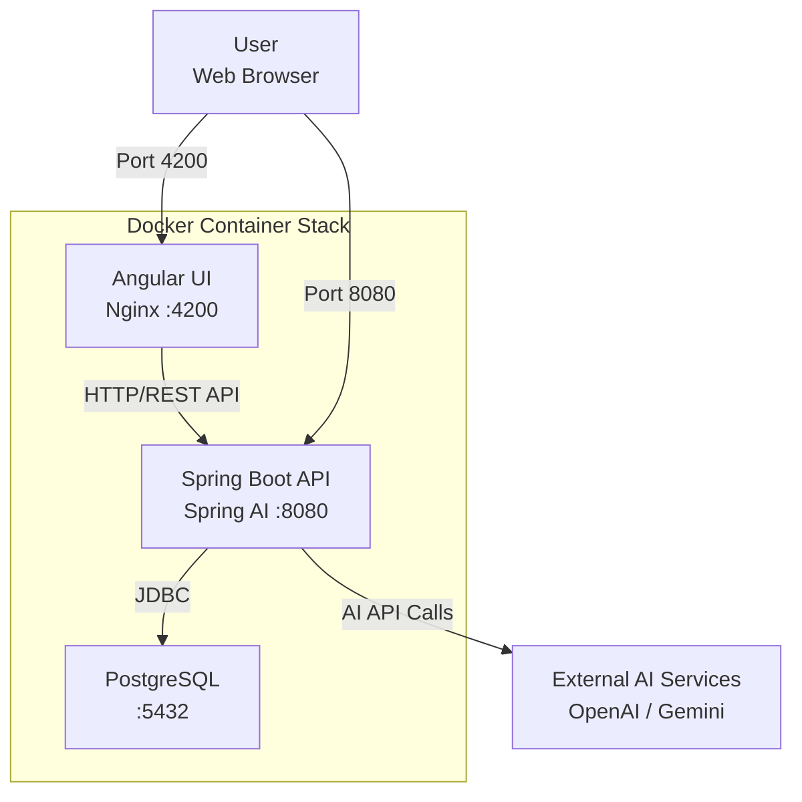
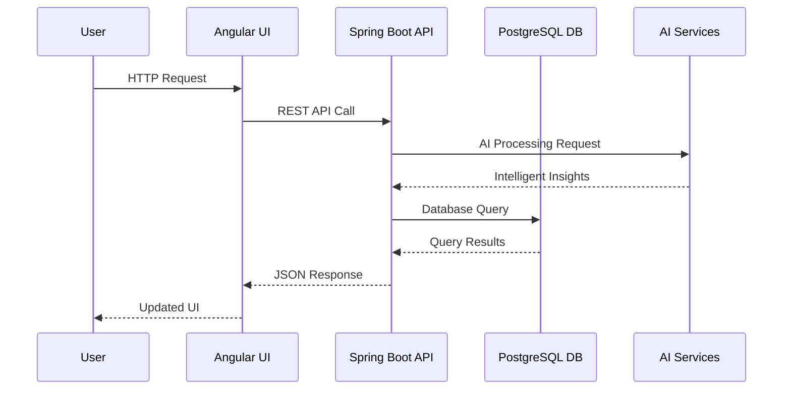

# 💰 Smart Expense Tracker - AI-Powered Financial Management

[](https://spring.io/projects/spring-boot)
[](https://angular.io/)
[](https://www.docker.com/)
[](https://www.postgresql.org/)

A production-ready, cloud-deployable full-stack application featuring AI-driven expense categorization, intelligent spending insights, and comprehensive financial tracking. Built with modern technologies and containerized for seamless deployment.

---

## 🏗️ Architecture Overview

### **System Architecture**


### **Data Flow**


### **Containerized Deployment**
The application is deployed using a Docker container stack:

| **Service** | **Technology** | **Port** | **Purpose** |
|-------------|---------------|----------|-------------|
| **Frontend** | Angular 21 or 17 + | Nginx | `4200` | Modern reactive UI |
| **Backend** | Spring Boot 3.2 + Spring AI | `8080` | REST API with AI integration |
| **Database** | PostgreSQL 15+ | `5432` | Persistent data storage |
| **AI Engine** | OpenAI GPT / Gemini | External | Intelligent categorization |

---

## ✨ Core Features

### 🤖 **AI-Powered Intelligence**
- **Smart Categorization**: Automatic expense classification using AI
- **Spending Insights**: AI-generated patterns and recommendations
- **Predictive Analytics**: Forecasting future spending trends

### 📊 **Financial Management**
- **Real-time Tracking**: Monitor expenses as they happen
- **Visual Analytics**: Interactive charts and graphs
- **Budget Planning**: Set and track spending limits
- **Multi-Currency Support**: Handle expenses in various currencies

### 🚀 **Modern Development**
- **Containerized**: Full Docker support with Compose
- **Responsive UI**: Angular Material with mobile-first design
- **Real-time Updates**: Reactive programming with RxJS
- **RESTful API**: Clean, documented endpoints

---

## 🛠️ Technology Stack

### **Frontend**
| Component | Technology | Purpose |
|-----------|------------|---------|
| **Framework** | Angular 17 | Progressive web app framework |
| **State Management** | RxJS + BehaviorSubject | Reactive data flow |
| **UI Components** | Angular Material | Modern, accessible components |
| **HTTP Client** | Angular HttpClient | API communication |
| **Routing** | Angular Router | SPA navigation |

### **Backend**
| Component | Technology | Purpose |
|-----------|------------|---------|
| **Framework** | Spring Boot 3.2 | Production-ready backend |
| **AI Integration** | Spring AI | OpenAI/Gemini integration |
| **Database ORM** | Spring Data JPA + Hibernate | Object-relational mapping |
| **Validation** | Bean Validation | Input sanitization |
| **Security** | Spring Security | Authentication & authorization |

### **Infrastructure**
| Component | Technology | Purpose |
|-----------|------------|---------|
| **Database** | PostgreSQL 15 | Relational database |
| **Containerization** | Docker + Docker Compose | Service orchestration |
| **Reverse Proxy** | Nginx | Static serving & load balancing |
| **Build Tools** | Maven + Node.js | Dependency management |
| **CI/CD** | GitHub Actions | Automated workflows |

---

## 🚀 Quick Start

### **Prerequisites**
- Docker & Docker Compose
- Node.js 18+ (for development)
- Java 17+ (for development)
- OpenAI API key (for AI features)

### **Deployment in 3 Steps**

1. **Clone the repository**
   ```bash
   git clone https://github.com/NahidAkhter/AI-Expense-Tracker.git
   cd expense-tracker
   ```

2. **Launch the application**
   ```bash
   # Start all services
   docker-compose up -d
   ```

### **Access the Application**
- 🌐 **Frontend**: http://localhost:4200
- 🔧 **Backend API**: http://localhost:8080/api
- 📊 **API Documentation**: http://localhost:8080/swagger-ui.html
- 🗄️ **Database Admin**: http://localhost:8081 (optional, with pgAdmin)

---

## 📱 Application Screenshots

### **Dashboard Overview**

*Real-time financial dashboard with spending analytics*

### **Expense Management**

*Add, edit, and categorize expenses with AI assistance*

### **AI Insights**

*Intelligent spending analysis and recommendations*

---

## 🔧 Development

### **Local Development Setup**

1. **Backend Setup**
   ```bash
   cd backend
   ./mvnw spring-boot:run
   ```

2. **Frontend Setup**
   ```bash
   cd frontend
   npm install
   npm start
   ```

3. **Database Setup**
   ```bash
   docker run --name expense-db -e POSTGRES_PASSWORD=secret -p 5432:5432 -d postgres:15
   ```

### **Running Tests**
```bash
# Backend tests
cd backend && ./mvnw test

# Frontend tests
cd frontend && npm test

# E2E tests
npm run e2e
```

---

## 📊 API Endpoints

| Method | Endpoint | Description |
|--------|----------|-------------|
| `GET` | `/api/expenses` | Retrieve all expenses |
| `GET` | `/api/expenses/{id}` | Get specific expense |
| `POST` | `/api/expenses` | Create new expense |
| `PUT` | `/api/expenses/{id}` | Update expense |
| `DELETE` | `/api/expenses/{id}` | Delete expense |
| `GET` | `/api/expenses/categories` | Get expense categories |
| `GET` | `/api/expenses/summary` | Get spending summary |
| `POST` | `/api/ai/analyze` | AI expense analysis |
| `GET` | `/api/health` | System health check |

---

## 🐳 Docker Configuration
you can check code file also for better understanding.
### **Services**
```yaml
# docker-compose.yml overview
services:
  postgres:
    image: postgres:15
    ports: ["5432:5432"]
    volumes: [postgres_data:/var/lib/postgresql/data]
    environment:
      POSTGRES_DB: expense_tracker
      POSTGRES_USER: admin
      POSTGRES_PASSWORD: ${DB_PASSWORD}

  spring-backend:
    build: ./backend
    ports: ["8080:8080"]
    depends_on: [postgres]
    environment:
      SPRING_AI_OPENAI_API_KEY: ${OPENAI_API_KEY}
      SPRING_DATASOURCE_URL: jdbc:postgresql://postgres:5432/expense_tracker

  angular-frontend:
    build: ./frontend
    ports: ["4200:4200"]
    depends_on: [spring-backend]
```

### **Build & Deploy**
```bash
# Build all images
docker-compose build

# Start services
docker-compose up -d

# View logs
docker-compose logs -f

# Stop services
docker-compose down
```

---

## 🔐 Environment Variables

| Variable | Description | Default |
|----------|-------------|---------|
| `OPENAI_API_KEY` | OpenAI API key for AI features | Required |
| `DB_PASSWORD` | PostgreSQL database password | `secret` |
| `SPRING_PROFILES_ACTIVE` | Spring profile | `docker` |
| `FRONTEND_URL` | Frontend origin | `http://localhost:4200` |

---

## 📈 Database Schema

```sql
-- Core expenses table
CREATE TABLE expenses (
    id BIGSERIAL PRIMARY KEY,
    description VARCHAR(500) NOT NULL,
    amount DECIMAL(10,2) NOT NULL CHECK (amount > 0),
    category VARCHAR(50) NOT NULL,
    date TIMESTAMP NOT NULL DEFAULT CURRENT_TIMESTAMP,
    ai_insights TEXT,
    created_at TIMESTAMP NOT NULL DEFAULT CURRENT_TIMESTAMP,
    updated_at TIMESTAMP NOT NULL DEFAULT CURRENT_TIMESTAMP
);

-- Indexes for performance
CREATE INDEX idx_expenses_date ON expenses(date DESC);
CREATE INDEX idx_expenses_category ON expenses(category);
CREATE INDEX idx_expenses_description ON expenses(description);
```

---

## 🧪 Testing Strategy

| Test Type | Tools | Coverage |
|-----------|-------|----------|
| **Unit Tests** | JUnit 5, Mockito | > 80% |
| **Integration Tests** | Spring Boot Test, Testcontainers | > 70% |
| **API Tests** | RestAssured, Postman | > 85% |
| **E2E Tests** | Cypress, Protractor | > 60% |
| **Performance Tests** | JMeter, Gatling | Load testing |

---

## 🤝 Contributing

1. **Fork the repository**
2. **Create a feature branch**
   ```bash
   git checkout -b feature/amazing-feature
   ```
3. **Commit your changes**
   ```bash
   git commit -m 'Add amazing feature'
   ```
4. **Push to the branch**
   ```bash
   git push origin feature/amazing-feature
   ```
5. **Open a Pull Request**

### **Development Guidelines**
- Follow Angular style guide for frontend
- Adhere to Spring Boot best practices
- Write comprehensive tests
- Update documentation accordingly

---

## 📄 License

N/A

---

## 🆘 Support

- 📖 **Documentation**: [Wiki](https://github.com/NahidAkhter/AI-Expense-Tracker/wiki)
- 🐛 **Bug Reports**: [Issues](https://github.com/NahidAkhter/AI-Expense-Tracker/issues)
- 💬 **Discussions**: [Q&A](https://github.com/NahidAkhter/AI-Expense-Tracker/discussions)
- 📧 **Contact**: nahidakhter0007@gmail.com

---

## 🌟 Acknowledgments

- [Spring AI](https://spring.io/projects/spring-ai) for AI integration
- [Angular Material](https://material.angular.io/) for UI components
- [Docker](https://www.docker.com/) for containerization
- [PostgreSQL](https://www.postgresql.org/) for reliable database
- [OpenAI](https://openai.com/) for AI capabilities

---

<div align="center">
  
**Made with ❤️ by [Nahid Akhter]**

[](https://github.com/NahidAkhter/AI-Expense-Tracker/stargazers)
[](https://github.com/NahidAkhter/AI-Expense-Tracker/network/members)

</div>
