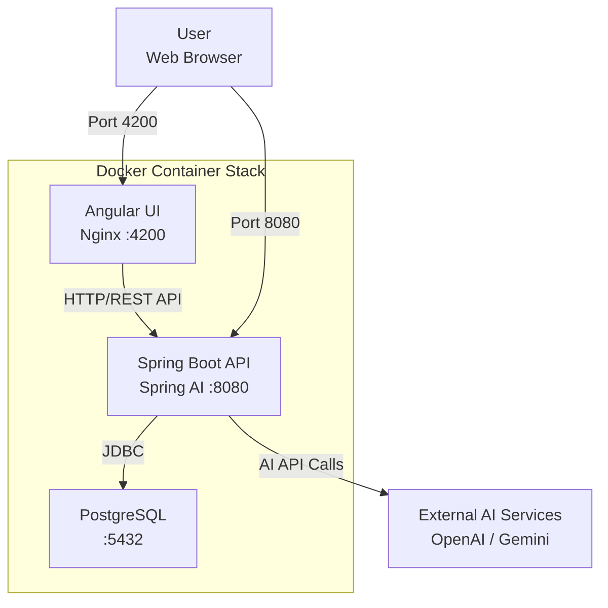

# 💰 Smart Expense Tracker - AI-Powered Financial Management
A production-ready, cloud-deployable full-stack application featuring AI-driven expense categorization, intelligent spending insights, and comprehensive financial tracking.

🏗️ Architecture Overview
## 📊 System Architecture



The application is deployed using a Docker container stack consisting of:

- **Angular Frontend**  
  Served via **Nginx** on port `4200`

- **Spring Boot Backend**  
  Runs on port `8080`, integrates **Spring AI** for intelligent processing

- **PostgreSQL Database**  
  Provides persistent storage on port `5432`

The backend leverages AI capabilities to deliver:
- AI-powered transaction categorization
- Smart spending insights


✨ Core Features
------------------

🤖 AI-Powered Categorization: Automatic expense classification using OpenAI GPT

📊 Smart Insights: AI-generated spending patterns and recommendations

📱 Modern UI: Angular 17 with reactive programming using RxJS

🐳 Containerized: Complete Docker Compose setup for easy deployment

📈 Real-time Updates: Reactive state management with BehaviorSubject

🛠️ Technology Stack
----------------------
Component	Technology	Purpose
Frontend	Angular 17, RxJS, Angular Material	Reactive UI with real-time updates
Backend	Spring Boot 3.2, Spring AI, JPA	REST API with AI integration
Database	PostgreSQL	Persistent data storage
AI Engine	OpenAI GPT via Spring AI	Intelligent expense analysis
Proxy	Nginx	Reverse proxy & static serving
Container	Docker, Docker Compose	Containerization & orchestration

🚀 Deployment Ready
----------------------
bash
# Single command to deploy entire stack


``` docker-compose up -d ```
Production-ready Docker configuration

Environment-based configuration management
----------------------------------------

Health checks for all services

Persistent volumes for database

Multi-stage Docker builds for optimized images

🔧 Key Technical Highlights
------------------------------
AI Integration: Spring AI with OpenAI for intelligent expense categorization

Reactive Architecture: RxJS observables for seamless data flow

Containerization: Complete Docker setup with service discovery

RESTful Design: Clean API with proper HTTP status codes & error handling

Database Migrations: Automatic schema updates with Spring Data JPA

Frontend: http://localhost:4200

Backend API: http://localhost:8080/api

Database: PostgreSQL on port 5432


